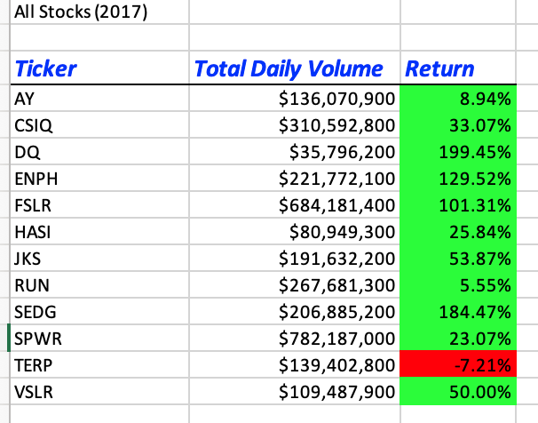
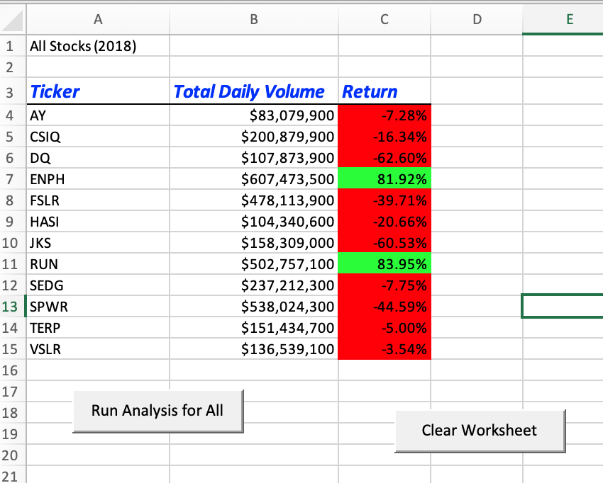
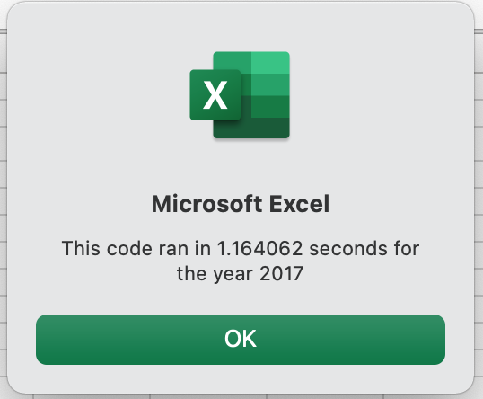
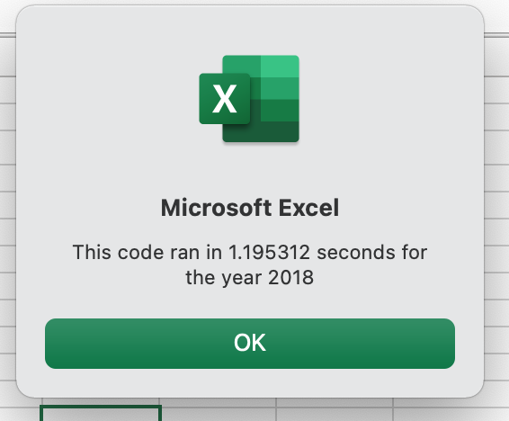

# Stock Analysis
Analyzing eco stock data
## Overview of Project
The purpose of this project was to analyze stock data for Steve, who has just gotten his degree in finance and is looking to help his parents determine which alternative energy stock to invest in. The goal of this project is to provide an analysis of stock data to show which companies should be invested in. 
## Results
### 2017 and 2018 Stock Performance
The goal of the project was to see the difference between 2017 and 2018 stock performance. The factors considered for this analysis were total volume (the total dollar value of all stocks being sold for each company) and pecentage return on investment, measured as the difference between starting value and ending value. To do this, header rows for Ticker, Total Daily Volume, and Return were created. Then, an array of tickers was created for each of the stock companies. A ticker index was also used to The results for 2017 are shown below:

### Refactored Code Time Performance
The code originally for the amount of time shown below:

After refactoring the code ran in the amount of time shown below, showing a slight improvement: 

## Summary
An advantage of refactoring code is that you can improve it and make it more able to be used in differing contexts. Improvements to the logic can increase efficiency and make code more usable. Refactoring old code can also save time if the alternative is starting new code from scratch. A disadvantage of refactoring code is that it can introduce errors into your code, and if you already have functioning code it may not be worth the time and effort. 
The original VBA script was advantageous because it provided a succint workbook for Steve to analyze his stocks of interest. The refactored code is advantageous because it ran faster and can be more easily applied to another set of data. 
